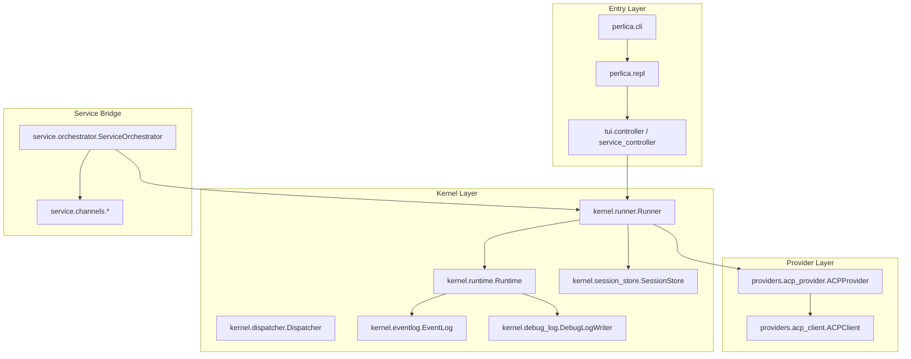
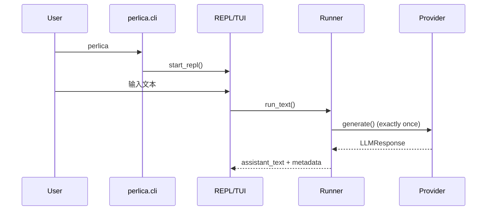
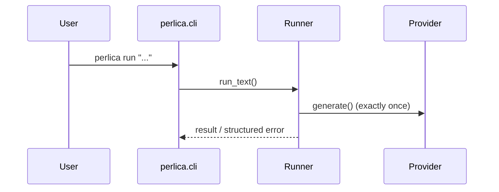

# Perlica Agent 架构规范（As-Built SSOT）

> 文档定位：当前仓库实现唯一事实源（Single Source of Truth）。
> 适用范围：`/Users/anchorcat/Desktop/Perlica-Agent`。
> 核心原则：文档先行（Doc-First，常规强制）。

---

## 1. 定位与治理

1. Perlica 当前定位为“单轮代理器（One Question, One Provider Call）”。
2. 每次用户输入只触发一次 provider 调用，不做本地多轮 agent 编排。
3. 模型失败不重试，失败信息结构化上报，由用户决策下一步。
4. provider 返回的 `tool_calls` 在 Perlica 本地不执行，仅记录证据链。
5. 任何功能/API/行为变更，必须先更新本文档与 `README.md`。

---

## 2. 模块分层（代码事实）

---

## 3. 运行链路（As-Built）

### 3.1 `perlica` / `perlica chat`

### 3.2 `perlica run`

### 3.3 `perlica --service`

1. ingest 为 `poll`。
2. 绑定联系人消息先发 ACK，再进入串行队列。
3. 最终回复串行，顺序与入站顺序一致。

---

## 4. 核心契约

### 4.1 基础类型

- `ToolCall(call_id, tool_name, arguments, risk_tier)`
- `ToolResult(call_id, ok, output, error=None, artifacts=[])`
- `LLMRequest(conversation_id, messages, tools, context)`
- `LLMResponse(assistant_text, tool_calls, finish_reason, usage, raw)`

### 4.2 单轮约束（强制）

1. `Runner.run_text()` 只调用一次 `_call_provider()`。
2. `llm_call_index` 在单次 run 内固定为 `1`。
3. 禁止“工具执行后再次调用模型”的本地循环。
4. 禁止自动摘要触发额外模型调用；超预算时仅确定性截断历史。

### 4.3 provider `tool_calls` 本地禁用执行

1. provider 返回 `tool_calls` 时，Runner 不调用 `Dispatcher.dispatch()`。
2. 每个 call 都会记录：
   - `tool.blocked(reason=single_call_mode_local_tool_dispatch_disabled)`
   - `tool.result(ok=false, error=single_call_mode_local_tool_dispatch_disabled)`
3. 证据写入 `session_messages`，用于 debug 回放。

### 4.4 Provider 失败语义

1. 失败不重试（fail-fast）。
2. `llm.provider_error` 采用结构化字段：
   - `provider_id`
   - `error`
   - `error_type`
   - `method`
   - `code`
   - `subtype`
   - `request_id`
   - `raw_shape`
3. CLI/Service 用户态错误文案显示结构化摘要，便于用户决策。

### 4.5 ACP 生命周期

Perlica 到 provider 的生命周期：

1. `initialize`
2. `session/new`
3. `session/prompt`
4. `session/close`

约束：

1. ACPClient 每个方法只发送一次请求（attempt=0）。
2. 不做 transport restart/backoff retry。
3. `session/prompt` 不做 Perlica 本地硬超时；只要 provider 进程仍在运行并持续输出进度/结果，即持续等待最终回包。
4. 非 `session/prompt` 方法（`initialize/session/new/session/close`）仍保留超时保护。
5. timeout/protocol/contract 错误直接上抛。

### 4.6 ACP 交互确认子协议

1. 在 `session/prompt` 期间，provider 可通过 `session/request_permission` 发起交互确认请求。
2. Perlica 进入 pending 交互态，等待用户选择或输入自定义文本。
3. 用户回答通过 `session/reply` 回传给 provider，随后继续同一 `session/prompt` 等待最终结果。
4. 不新增第二次 provider 主调用；该流程仍满足“单次输入 -> 一次 provider 调用”约束。
5. pending 仅允许一个活动请求；并发回答按“先到先得”，后续回答标记过期并拒绝。
6. 交互层统一由 `interaction.coordinator` 管理，TUI 与 service 共用同一 pending 状态机。
7. 交互命令面：
   - `/pending`：查看当前待确认问题与可选项
   - `/choose <index|text...>`：提交编号选择或自定义文本
8. pending 存在时，非 slash 输入默认作为交互回答；service 远端入站启用 pending 快速通道，优先提交回答再继续业务链路。
9. Claude provider 在 `permission_denials.tool_name=AskUserQuestion` 场景下会转换为交互请求（pending），并在同一次 `generate()` 内按回答继续后续轮次，直到产出最终结果或触发 `error_max_turns` 保护。

---

## 5. 存储与状态

### 5.1 关键数据库

1. `.perlica_config/contexts/<ctx>/eventlog.db`
2. `.perlica_config/contexts/<ctx>/sessions.db`
3. `.perlica_config/contexts/<ctx>/approvals.db`
4. `.perlica_config/service/service_bridge.db`

### 5.2 调试日志

1. 路径：`.perlica_config/contexts/<ctx>/logs/`
2. 主文件：`debug.log.jsonl`
3. 轮转：`debug.log.jsonl.1` ... `.N`
4. 默认：10MB / 5 files
5. fail-open：写日志失败不阻断主流程

---

## 6. 配置语义（当前）

1. `runtime.max_tool_calls`：保留字段，单轮模式下不驱动执行流程（no-op）。
2. `runtime.max_summary_attempts`：保留字段，单轮模式下不触发模型摘要（no-op）。
3. `providers.claude.acp.max_retries`：保留字段，ACPClient 单轮模式下不执行重试（no-op）。

---

## 7. 安全与治理

1. 高风险 shell 命令仍由 policy engine 阻断。
2. `DISPATCH_ACTIVE` 仍约束“工具必须经 Dispatcher”；但 provider `tool_calls` 路径已被 Runner 层禁用。
3. Service 入站严格忽略 `from_me`。
4. 联系人授权优先于 chat_id。

---

## 8. 可观测性

### 8.1 关键事件

1. `inbound.message.received`
2. `llm.requested`
3. `llm.responded`
4. `llm.provider_error`
5. `llm.single_call.enforced`
6. `tool.blocked`
7. `tool.result`
8. `context.truncated`
9. `acp.request.sent`
10. `acp.request.timeout`
11. `acp.session.started`
12. `acp.session.closed`
13. `acp.notification.received`
14. `interaction.requested`
15. `interaction.answered`
16. `interaction.answer_rejected`
17. `interaction.resolved`
18. `acp.reply.sent`
19. `acp.reply.failed`

### 8.2 Debug 推荐证据链

`inbound -> llm.requested(1) -> llm.responded | llm.provider_error -> tool.blocked/tool.result`

交互确认链路（Interaction）：

`interaction.requested -> interaction.answered -> acp.reply.sent -> interaction.resolved`

推荐在日志中按以下字段定位：

`run_id / trace_id / conversation_id / session_id / interaction_id`

---

## 9. 开发流程规则（Doc-First）

1. 功能/API/行为改动前，先更新：
   - `Perlica-Agent项目开发架构.md`
   - `README.md`
2. 纯测试与 typo 可例外。
3. Debug 改动必须附日志证据链（eventlog/debug.log/test failure）。

---

## 10. 参考代码入口

1. `src/perlica/kernel/runner.py`
2. `src/perlica/providers/acp_client.py`
3. `src/perlica/providers/acp_provider.py`
4. `src/perlica/service/orchestrator.py`
5. `src/perlica/cli.py`
