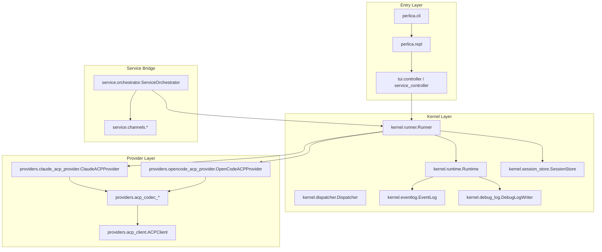
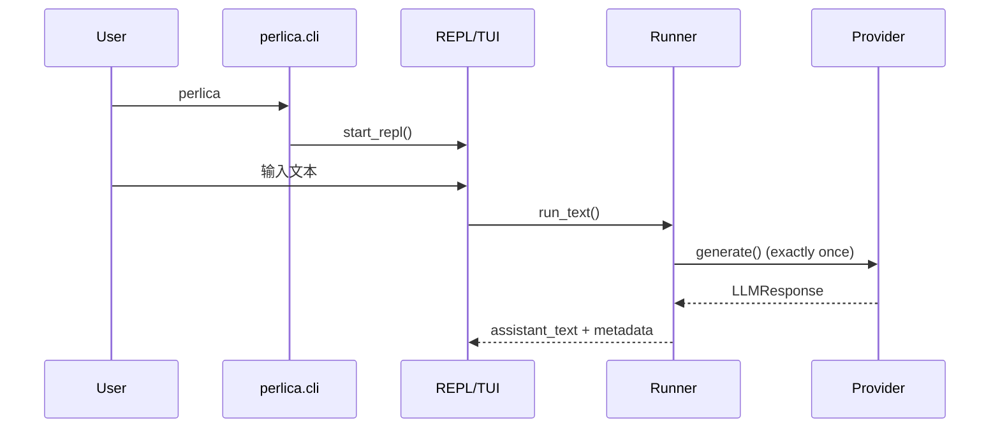
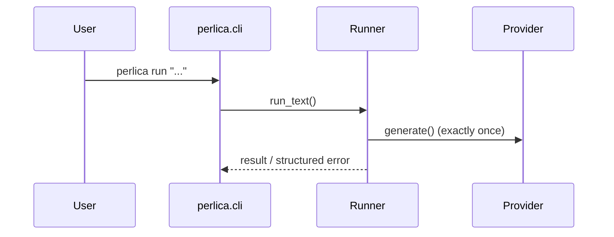

# Perlica Agent 架构规范（As-Built SSOT）

> 文档定位：当前仓库实现唯一事实源（Single Source of Truth）。
> 适用范围：`/Users/anchorcat/Desktop/Perlica-Agent`。
> 核心原则：文档先行（Doc-First，常规强制）。

---

## 1. 定位与治理

1. Perlica 当前定位为“单轮代理器（One Question, One Provider Call）”。
2. 每次用户输入只触发一次 provider 调用，不做本地多轮 agent 编排。
3. 模型失败不重试，失败信息结构化上报，由用户决策下一步。
4. provider 返回的 `tool_calls` 在 Perlica 本地不执行，仅记录证据链。
5. 任何功能/API/行为变更，必须先更新本文档与 `README.md`。

---

## 2. 模块分层（代码事实）

Provider 事实（As-Built）：

1. provider profile 当前支持 `claude` 与 `opencode`。
2. 二者主路径均走 ACP（ACP-first）。
3. provider 方言（`session/new` 注入、`session/prompt` 参数和结果归一化）下沉到 provider codec；ACPClient 不再感知具体 provider。

---

## 3. 运行链路（As-Built）

### 3.1 `perlica` / `perlica chat`

### 3.2 `perlica run`

### 3.3 `perlica --service`

1. ingest 为 `poll`。
2. 绑定联系人消息先发 ACK，再进入串行队列。
3. 最终回复串行，顺序与入站顺序一致。
4. `/service channel use` 的可选渠道与提示文案由 `service.channels.registry` 动态生成，不在主流程硬编码 `imessage`。

### 3.4 Slash 会话命令约束（As-Built）

1. `/session` 子命令包含：`list/new/use/current/delete`。
2. `/session delete <ref>` 仅允许删除“当前 context 下的其他会话”。
3. 当前会话禁止删除；如需删除原会话，必须先 `/session use <other_ref>` 切换当前会话。

---

## 4. 核心契约

### 4.1 基础类型

- `ToolCall(call_id, tool_name, arguments, risk_tier)`
- `ToolResult(call_id, ok, output, error=None, artifacts=[])`
- `LLMRequest(conversation_id, messages, tools, context)`
- `LLMResponse(assistant_text, tool_calls, finish_reason, usage, raw)`

补充约束：

1. Runner 传给 provider 的 `LLMRequest.tools` 固定为空数组。
2. `LLMRequest.context.provider_config` 仅承载运行时策略字段（如 `tool_execution_mode`、`injection_failure_policy`），`mcp/skills` 不再通过该字段注入。

### 4.2 单轮约束（强制）

1. `Runner.run_text()` 只调用一次 `_call_provider()`。
2. `llm_call_index` 在单次 run 内固定为 `1`。
3. 禁止“工具执行后再次调用模型”的本地循环。
4. 禁止自动摘要触发额外模型调用；超预算时仅确定性截断历史。

### 4.2.1 Provider 启动静态同步（As-Built）

1. `run/chat/service` 启动阶段会在 Runtime 创建前执行 provider 静态配置同步（MCP + Skills）。
2. 同步 payload 来源：
   - MCP：`.perlica_config/mcp/servers.toml` 中 `enabled=true` 的服务器
   - Skills：`SkillLoader(settings.skill_dirs).load().skills` 全量已加载 skills
3. 作用域策略固定为 `project_first`：优先写项目级配置，必要时回退用户级配置。
4. 合并策略固定为“仅管理 Perlica 命名空间”：
   - MCP key 前缀：`perlica.<server_id>`
   - Skill 目录前缀：`perlica-<skill-id>`
4.1 capability 门控生效：仅当 provider profile 的 `supports_mcp_config/supports_skill_config` 为 `true` 时，才会同步对应类别；关闭时直接跳过并上报 skip。
5. `stale_cleanup=true`：每次同步删除过期 `perlica.*` / `perlica-*` 条目，保留非 Perlica 条目。
6. provider-specific 配置器解耦：
   - `claude`：`.mcp.json` / `.claude/skills`（项目级）与 `~/.claude/settings.json` / `~/.claude/skills`（用户级）
   - `opencode`：`opencode.json` / `.opencode/skills`（项目级）与 `~/.config/opencode/opencode.json` / `~/.config/opencode/skills`（用户级）
7. 同步结果在启动时输出“成功/跳过/失败”明细（含 mcp/skill 名称与目标路径）；失败仅告警不中断启动。
8. trigger 匹配仍保留，仅用于 `skill.selected/skill.skipped` 事件和诊断，不再参与注入判定。
9. 内置 AppleScript skill（`macos-applescript-operator`）作为已加载 skill 之一参与静态同步，不作为 system message 注入。

### 4.3 provider `tool_calls` 本地禁用执行

1. provider 返回 `tool_calls` 时，Runner 不调用 `Dispatcher.dispatch()`。
2. 每个 call 都会记录：
   - `tool.blocked(reason=single_call_mode_local_tool_dispatch_disabled)`
   - `tool.result(ok=false, error=single_call_mode_local_tool_dispatch_disabled)`
3. 证据写入 `session_messages`，用于 debug 回放。

### 4.4 Provider 失败语义

1. 失败不重试（fail-fast）。
2. `llm.provider_error` 采用结构化字段：
   - `provider_id`
   - `error`
   - `error_type`
   - `method`
   - `code`
   - `subtype`
   - `request_id`
   - `raw_shape`
3. CLI/Service 用户态错误文案显示结构化摘要，便于用户决策。

### 4.5 ACP 生命周期

Perlica 到 provider 的生命周期：

1. `initialize`
2. `session/new`
3. `session/prompt`
4. `session/close`

约束：

1. ACPClient 每个方法只发送一次请求（attempt=0）。
2. 不做 transport restart/backoff retry。
3. `session/prompt` 不做 Perlica 本地硬超时；只要 provider 进程仍在运行并持续输出进度/结果，即持续等待最终回包。
4. 非 `session/prompt` 方法（`initialize/session/new/session/close`）仍保留超时保护。
5. timeout/protocol/contract 错误直接上抛。
6. `session/new`/`session/prompt` 的 provider 方言由 provider codec 负责，ACPClient 仅负责生命周期编排和协议收发。
7. `session/new` 不承载 Perlica 的 `skills/mcp` 注入语义；Runner 也不再注入 `mcp/skills`。
8. 为兼容 opencode ACP 参数校验，`session/new` 在 opencode provider 下保留 `mcpServers=[]` 空数组字段（仅协议兼容，不承载 Perlica 注入）。
9. `session/prompt` 结果归一化采用“主路径 + 保守回退”：
   - 主路径：标准 `session/update.agent_message_chunk` 文本拼接。
   - 回退路径：仅从白名单字段提取“用户可见回复文本”（如 `agent_message*` 变体、`result.message/text/content`，含 `output_text` 等可见块）。
   - 禁止：将 `agent_thought_chunk` 等思考文本作为最终回复输出。

### 4.6 ACP 交互确认子协议

1. 在 `session/prompt` 期间，provider 可通过 `session/request_permission` 发起交互确认请求。
2. Perlica 进入 pending 交互态，等待用户选择或输入自定义文本。
3. 用户回答通过 `session/reply` 回传给 provider，随后继续同一 `session/prompt` 等待最终结果。
4. 不新增第二次 provider 主调用；该流程仍满足“单次输入 -> 一次 provider 调用”约束。
5. pending 仅允许一个活动请求；并发回答按“先到先得”，后续回答标记过期并拒绝。
6. 交互层统一由 `interaction.coordinator` 管理，TUI 与 service 共用同一 pending 状态机。
7. 交互命令面：
   - `/pending`：查看当前待确认问题与可选项
   - `/choose <index|text...>`：提交编号选择或自定义文本
8. pending 存在时，非 slash 输入默认作为交互回答；service 远端入站启用 pending 快速通道，优先提交回答再继续业务链路。
9. Claude provider 在 `permission_denials.tool_name=AskUserQuestion` 场景下会转换为交互请求（pending），并在同一次 `generate()` 内按回答继续后续轮次，直到产出最终结果或触发 `error_max_turns` 保护。

### 4.6.1 OpenCode 解析兼容策略（As-Built）

1. OpenCode 主路径仍遵循 ACP `session/update` + `session/prompt.result`。
2. 当标准 `agent_message_chunk` 未命中但存在可见文本证据时，OpenCode provider codec 仅在“用户可见字段白名单”内做保守回退提取并继续返回用户文本。
3. 回退提取命中时发事件 `provider.acp.response.fallback_text_used`，便于排障与统计。
4. 禁止将 `agent_thought_chunk`、推理草稿等 thought 字段作为最终回复回退输出。
5. 若无可见文本且无 tool_calls，仍按合同失败处理（触发 `llm.invalid_response`）。

### 4.7 串行任务状态机（Single Active Task）

1. Runtime 维护单活动任务状态机：`IDLE -> RUNNING -> AWAITING_INTERACTION -> RUNNING -> COMPLETED/FAILED -> IDLE`。
2. `Runner.run_text()` 启动任务并独占执行；同一时刻只允许一个活动任务。
3. provider 在任务内发起 `session/request_permission` 时，状态转为 `AWAITING_INTERACTION`。
4. 用户提交交互回答后，状态回到 `RUNNING`，继续等待同一任务最终结果。
5. 聊天模式在 `RUNNING` 且非 `AWAITING_INTERACTION` 时拒绝新普通输入；service 模式按序排队，不抢占当前任务。
6. 关键任务事件：
   - `task.started`
   - `task.state.changed`
   - `task.command.deferred`
   - `task.command.rejected`

### 4.8 首次 Provider 选择状态（First-Run Provider Selection）

1. 配置层新增 `model.provider_selected`。
2. 首次 TTY 启动且 `provider_selected=false` 时，CLI 要求用户在 `claude|opencode` 中选择并持久化。
3. 首次非TTY启动且 `provider_selected=false` 时，必须显式 `--provider`，否则退出码 `2`。
4. 选择完成后写入：
   - `model.default_provider`
   - `model.provider_selected=true`
5. 新会话 `provider_locked` 始终写入当前活动 provider（`claude` 或 `opencode`）。
6. 运行时解析 provider 采用严格匹配：会话锁定 provider 未注册/不可用时直接失败，不隐式回退默认 provider。

---

## 5. 存储与状态

### 5.1 关键数据库

1. `.perlica_config/contexts/<ctx>/eventlog.db`
2. `.perlica_config/contexts/<ctx>/sessions.db`
3. `.perlica_config/contexts/<ctx>/approvals.db`
4. `.perlica_config/service/service_bridge.db`

### 5.2 调试日志

1. 路径：`.perlica_config/contexts/<ctx>/logs/`
2. 主文件：`debug.log.jsonl`
3. 轮转：`debug.log.jsonl.1` ... `.N`
4. 默认：10MB / 5 files
5. fail-open：写日志失败不阻断主流程

---

## 6. 配置语义（当前）

1. `runtime.max_tool_calls`：保留字段，单轮模式下不驱动执行流程（no-op）。
2. `runtime.max_summary_attempts`：保留字段，单轮模式下不触发模型摘要（no-op）。
3. `providers.<provider>.acp.max_retries`：保留字段，ACPClient 单轮模式下不执行重试（no-op）。
4. `model.provider_selected`：
   - `false`：首次启动尚未完成 provider 选择。
   - `true`：默认 provider 已确认，可直接运行。
5. `providers.<id>.capabilities`：
   - `supports_mcp_config`：是否支持 MCP 静态同步
   - `supports_skill_config`：是否支持 Skill 静态同步
   - `tool_execution_mode`：当前默认 `provider_managed`
   - `injection_failure_policy`：当前默认 `degrade`

### 6.1 系统 Prompt 策略（As-Built）

1. 系统 Prompt 文件来源：`.perlica_config/prompts/system.md`。
2. Prompt 角色定位为 macOS 电脑管家：把用户意图转成可执行电脑操作。
3. Prompt 要求“任务自适应”工具选择：shell 与 AppleScript 按任务类型优先。
4. Prompt 约束 CLI 工具权限默认允许，不因保守策略阻断执行。
5. Prompt 最高优先约束：系统级高影响操作先确认再执行。
6. Prompt 失败回报要求结构化：失败原因、命令证据（含退出码/stderr 摘要）、下一步建议。

### 6.2 内置 AppleScript Skill 策略（As-Built）

1. 默认内置 skill 文件位于 `.perlica_config/skills/macos-applescript-operator.skill.json`。
2. 该 skill 面向 GUI/App 自动化任务（如 Finder、System Events、Safari/Chrome、菜单点击、窗口激活、输入确认）。
3. skill 的 `system_prompt` 强化以下执行规范：
   - GUI/App 操作优先 AppleScript。
   - 优先输出可直接执行的 `osascript`（here-doc）命令。
   - 优先使用稳定选择器（应用名、菜单路径、窗口标题），避免脆弱坐标点击。
   - 失败时输出结构化证据（命令、退出码/错误摘要、下一步修复）。
4. 同步语义：该 skill 在 provider 支持 `supports_skill_config=true` 时会在启动阶段同步到 provider 静态技能目录，无需等待 trigger 命中。
5. 该 skill 的行为与单轮约束兼容：不恢复本地 tool loop，不启用 provider `tool_calls` 本地执行。

---

## 7. 安全与治理

1. 高风险 shell 命令仍由 policy engine 阻断；系统级动作在用户确认前不执行。
2. `DISPATCH_ACTIVE` 仍约束“工具必须经 Dispatcher”；但 provider `tool_calls` 路径已被 Runner 层禁用。
3. Service 入站严格忽略 `from_me`。
4. 联系人授权优先于 chat_id。

---

## 8. 可观测性

### 8.1 关键事件

1. `inbound.message.received`
2. `llm.requested`
3. `llm.responded`
4. `llm.provider_error`
5. `llm.single_call.enforced`
6. `tool.blocked`
7. `tool.result`
8. `context.truncated`
9. `provider.acp.request.sent`
10. `provider.acp.request.timeout`
11. `provider.acp.session.started`
12. `provider.acp.session.closed`
13. `provider.acp.notification.received`
14. `interaction.requested`
15. `interaction.answered`
16. `interaction.answer_rejected`
17. `interaction.resolved`
18. `provider.acp.reply.sent`
19. `provider.acp.reply.failed`

### 8.2 Debug 推荐证据链

`inbound -> llm.requested(1) -> llm.responded | llm.provider_error -> tool.blocked/tool.result`

交互确认链路（Interaction）：

`interaction.requested -> interaction.answered -> provider.acp.reply.sent -> interaction.resolved`

推荐在日志中按以下字段定位：

`run_id / trace_id / conversation_id / session_id / interaction_id`

---

## 9. 开发流程规则（Doc-First）

1. 功能/API/行为改动前，先更新：
   - `Perlica-Agent项目开发架构.md`
   - `README.md`
2. 纯测试与 typo 可例外。
3. Debug 改动必须附日志证据链（eventlog/debug.log/test failure）。

---

## 10. 参考代码入口

1. `src/perlica/kernel/runner.py`
2. `src/perlica/providers/acp_client.py`
3. `src/perlica/providers/claude_acp_provider.py`
4. `src/perlica/providers/opencode_acp_provider.py`
5. `src/perlica/providers/acp_codec.py`
6. `src/perlica/providers/acp_codec_claude.py`
7. `src/perlica/providers/acp_codec_opencode.py`
8. `src/perlica/service/orchestrator.py`
9. `src/perlica/cli.py`
